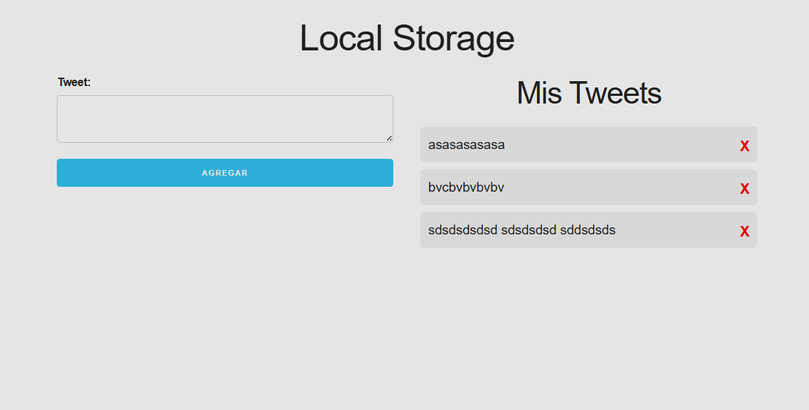

# Proyecto: LocalStorage

## Descripción

Pequeño proyecto de práctica para guardar y mostrar datos en el navegador usando la API `localStorage`. Permite añadir, listar y eliminar elementos (tweets de ejemplo) y persiste la información entre recargas.

## Lo aprendido

- Uso de la API `localStorage` para persistencia sencilla en el cliente.
- Manipulación del DOM con JavaScript para añadir, renderizar y eliminar elementos.
- Serialización y deserialización de datos con `JSON.stringify` / `JSON.parse`.
- Gestión de eventos (`submit`, `click`) y validación básica de formularios.
- Organización básica de archivos (HTML, CSS, JS) y estructura de proyecto.

## Tecnologías usadas

- HTML5
- CSS (normalize.css, skeleton.css, custom.css)
- JavaScript (Vanilla JS)
- LocalStorage Web API

## Autor

Javier

## Notas

- La captura mostrada está en `assets/img/tweets.png`.
- Si quieres que añada más documentación, instrucciones de uso o un archivo `LICENSE`, dímelo y lo agrego.
